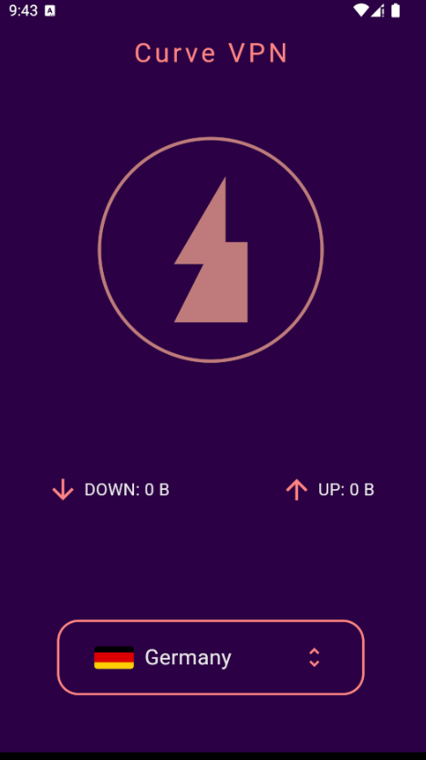

# Curve VPN 🌐

Curve VPN is a sleek and secure VPN application for Android, built using Flutter. It leverages the powerful Xray core for VPN functionalities and is designed with integration for AdMob monetization.

## Features 🚀
- **Secure Connection**: Powered by the Xray core for robust VPN protocols.
- **Customizable UI**: A modern and intuitive design ready for customization.
- **AdMob Integration**: Monetize the app with Google AdMob.
- **Flutter-based**: Cross-platform development for rapid prototyping and scalability.

## Project Status
🚧 **Under Development**: The project structure and design files are complete, but functionality implementation is still in progress.

---

## Getting Started

### Prerequisites
- **Flutter**: Ensure Flutter is installed. Follow the [Flutter installation guide](https://docs.flutter.dev/get-started/install).
- **AdMob Account**: Set up an AdMob account and obtain your AdMob App ID.

### Installation

1. **Clone the repository**
   ```bash
   git clone https://github.com/MmdUnion/curve_vpn.git
   cd curve_vpn
    ```

2. **Install dependencies**
    ```bash
    flutter pub get
    ```

3. **Set up AdMob**
<ul>
    <li>Update the `android/app/src/main/AndroidManifest.xml` file with your AdMob App ID.</li>
    <li>Update the line 39: `lib/pages/home_page.dart` file with your AdMob App ID.</li>
</ul>

4. **Running the App**
    ```bash
    flutter run
    ```

### Screenshots
 
